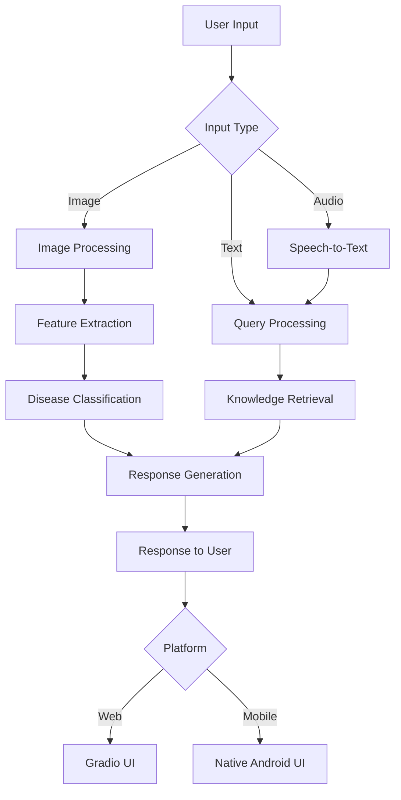

<div align="center">

# 🌱 KrishiSahayak+Gemma

[](https://opensource.org/licenses/MIT)
[](https://www.python.org/downloads/)
[](https://pytorch.org/)
[](https://gradio.app/)
[](https://developer.android.com/)

**Empowering farmers with AI-driven agricultural assistance**

</div>

## 📋 Table of Contents
- [✨ Features](#-features)
- [🏗️ Architecture](#%EF%B8%8F-architecture)
- [🚀 Getting Started](#-getting-started)
- [📱 Mobile App](#-mobile-application)
- [🌐 Web Demo](#-web-demo)
- [📊 Project Structure](#-project-structure)
- [🤝 Contributing](#-contributing)
- [📄 License](#-license)

## ✨ Features

### 🌾 Core Capabilities
- **🌱 Plant Disease Diagnosis** - AI-powered image analysis for crop health
- **🔍 Knowledge Base** - Extensive agricultural database with offline access
- **🗣️ Multilingual Support** - Voice and text in regional languages
- **📱 Cross-Platform** - Web and mobile interfaces for all users

### 🌐 Web Demo
<div align="center">
  
  
  
</div>

### 📱 Mobile App
<div align="center">
  
  
  
</div>

## 🖥️ Web Demo

**Status:** 🟢 Fully Functional

A feature-rich web application that demonstrates the core capabilities of our agricultural AI assistant. Perfect for testing and demonstration purposes.

### Key Features:
- 🌿 Plant disease diagnosis from images
- 🎤 Voice query support in multiple languages
- 📝 Detailed diagnostic reports with remedies
- 🎧 Audio responses in regional languages
- 🔍 Knowledge base integration for accurate information

### Quick Start:
```bash
# Navigate to web_demo directory
cd web_demo

# Install dependencies
pip install -r requirements.txt

# Launch the application
python app.py
```

*For detailed setup instructions, see the [Web Demo Documentation](./web_demo/README.md).*

## 📱 Android Application

**Status:** 🟡 In Development (MVP Phase)

A fully offline-capable mobile application designed specifically for farmers in remote areas with limited or no internet connectivity.

### Planned Features:
- 📶 100% offline functionality
- 🌍 Local language support
- 🔋 Low-resource operation
- 📊 Crop health monitoring
- 📅 Agricultural calendar
- 💡 Expert farming tips

### 🏗️ System Architecture

KrishiSahayak+Gemma is built with a modular, scalable architecture that supports both web and mobile platforms while sharing a common knowledge base and AI capabilities.

### 🧱 Core Components

| Component | Technologies | Description |
|-----------|--------------|-------------|
| **AI Engine** | PyTorch, Transformers, Gemma | Handles NLP, image processing, and model inference |
| **Knowledge Base** | FAISS, SQLite, CSV | Stores and retrieves agricultural knowledge |
| **Web Interface** | Gradio, FastAPI | Provides user interaction and visualization |
| **Mobile App** | Android, SQLite | Offline-capable native application |
| **Data Processing** | Pandas, NumPy | Handles data transformation and preparation |

### 🔄 Data Flow



### 🗃️ Data Storage

#### Web Version
- `knowledge_base.faiss` - Vector embeddings for semantic search
- `knowledge_base_text.pkl` - Pre-processed text data
- `knowledge_base.csv` - Structured agricultural knowledge

#### Mobile Version
- `knowledge_base.sqlite` - Local database for offline access
- Pre-computed embeddings for fast on-device search

### 🚀 Deployment

#### Web Demo
1. Clone the repository
2. Install Python dependencies
3. Run the Gradio application
4. Access via web browser

#### Android App
1. Open project in Android Studio
2. Build the APK
3. Install on Android device
4. All data is bundled with the app for offline use

### 🧱 Core Components

1. **AI Engine**
   - Built on PyTorch and Transformers
   - Utilizes Gemma for natural language understanding
   - Implements Retrieval-Augmented Generation (RAG) for accurate responses
   - Handles image-based disease classification
   - Processes voice queries with Whisper ASR

2. **Knowledge Base**
   - Structured agricultural database (SQLite for mobile, CSV for web)
   - Vector embeddings using FAISS for semantic search
   - Pre-processed text data for efficient retrieval
   - Localized content for regional languages

3. **Web Interface**
   - Built with Gradio for rapid prototyping
   - Real-time inference pipeline
   - Interactive visualization of results
   - Responsive design for various devices

4. **Mobile Application**
   - Native Android implementation
   - Offline-first architecture
   - Local SQLite database
   - Optimized for low-resource environments

### 🔄 Data Flow


### 🗃️ Data Storage

- **Web Version**:
  - `knowledge_base.faiss` - Vector embeddings for semantic search
  - `knowledge_base_text.pkl` - Pre-processed text data
  - `knowledge_base.csv` - Structured agricultural knowledge

- **Mobile Version**:
  - `knowledge_base.sqlite` - Local database for offline access
  - Pre-computed embeddings for fast on-device search

### 🚀 Deployment

#### Web Demo
1. Clone the repository
2. Install Python dependencies
3. Run the Gradio application
4. Access via web browser

#### Android App
1. Open project in Android Studio
2. Build the APK
3. Install on Android device
4. All data is bundled with the app for offline use

## 🛠 Technical Highlights:
- Uses quantized `gemma-3n-q4_k_m.gguf` model
- Optimized for low-end Android devices
- Minimal storage and memory footprint
- Regular offline knowledge base updates

### Development Progress:
- [x] Core AI model integration
- [x] Basic UI/UX implementation
- [ ] Local database setup
- [ ] Offline knowledge base
- [ ] Field testing

## 📚 Documentation

### 📄 Key Documents

| Document | Description |
|----------|-------------|
| [Technical Report](docs/TECHNICAL_REPORT.md) | Comprehensive technical specifications and data architecture |
| [Model Card](web_demo/MODEL_CARD.md) | Model details, performance, and limitations |
| [Technical Decision Log](docs/technical_decision_log.md) | Key technical decisions and rationale |
| [Contribution Guidelines](CONTRIBUTING.md) | How to contribute to the project |

> 💡 All documentation is stored in the `docs/` directory. Please ensure documentation is kept up-to-date with code changes.

## 📁 Project Structure

```
KrishiSahayak-Gemma/
├── 📁 android_app/         # Android application source
│   └── 📁 src/main/assets/
│       └── 📄 knowledge_base.sqlite  # Local SQLite database for offline use
│
├── 📁 asset_preparation/   # Data processing scripts
│   ├── 📄 build_index.py           # Builds FAISS index
│   ├── 📄 create_database.py       # Creates knowledge base
│   └── 📄 generate_knowledge_base_gemma.py  # Processes data for Gemma
│
├── 📁 data/                # Data storage
│   ├── 📄 knowledge_base.csv       # Agricultural knowledge base (CSV)
│   ├── 📄 knowledge_base.faiss    # Vector index for semantic search
│   ├── 📄 knowledge_base_text.pkl # Pre-processed text data
│   ├── 📁 processed/       # Processed datasets
│   └── 📁 raw/             # Raw data files
│
├── 📁 docs/                # Project documentation
│   └── 📄 model_card.md    # Model documentation
│
├── 📁 reports/             # Analysis and performance reports
│   ├── 📁 eda_results/     # Exploratory data analysis
│   └── 📁 validation_results/  # Model validation metrics
│
└── 📁 web_demo/            # Web-based demonstration
    ├── 📄 app.py                  # Main application
    ├── 📄 requirements.txt        # Python dependencies
    │
    └── 📁 src/                   # Source code
        ├── 📁 pipeline/          # ML pipeline components
        │   ├── 📄 inference.py   # Model inference
        │   └── 📄 uncertainty.py # Uncertainty quantification
        │
        ├── 📁 rag/               # Retrieval-Augmented Generation
        │   └── 📄 search.py      # Knowledge base search
        │
        └── 📁 utils/             # Utility functions
            └── 📄 audio_processing.py  # Audio handling
```

### 📊 File Descriptions

| File | Purpose |
|------|---------|
| `knowledge_base.sqlite` | SQLite database for Android app (offline use) |
| `knowledge_base.faiss` | FAISS index for efficient similarity search |
| `knowledge_base.csv` | Structured agricultural knowledge base |
| `knowledge_base_text.pkl` | Serialized pre-processed text data |
| `app.py` | Main Gradio web application |
| `requirements.txt` | Python dependencies for the web demo |

## 🚀 Getting Started

### 📋 Prerequisites

| Requirement | Version | Installation |
|-------------|---------|--------------|
| Python | 3.8+ | [Download](https://www.python.org/downloads/) |
| pip | Latest | `python -m pip install --upgrade pip` |
| Git | Latest | [Download](https://git-scm.com/downloads) |
| Android Studio | 2022.3+ | [Download](https://developer.android.com/studio) |

### ⚙️ Installation

1. **Clone the repository**
   ```bash
   git clone https://github.com/VIKAS9793/KrishiSahayak_Gemma.git
   cd KrishiSahayak_Gemma
   ```

2. **Set up a virtual environment** (recommended)
   ```bash
   # Windows
   python -m venv venv
   .\venv\Scripts\activate
   
   # macOS/Linux
   python3 -m venv venv
   source venv/bin/activate
   ```

3. **Install dependencies**
   ```bash
   cd web_demo
   pip install -r requirements.txt
   ```

### 🌐 Running the Web Demo

<div align="center">
  
  
</div>

1. **Start the application**
   ```bash
   python app.py
   ```

2. **Access the web interface**
   ```
   http://localhost:7860
   ```

   > 💡 **Tip**: The web interface will open automatically in your default browser.

### 📱 Building the Android App

<div align="center">
  
  
</div>

1. Open the `android_app` directory in Android Studio
2. Wait for project sync to complete
3. Connect an Android device or start an emulator
4. Click **Run** (▶️) to build and deploy

### 🔍 Verifying the Installation

1. **Check web dependencies**
   ```bash
   python -c "import torch; print(f'PyTorch version: {torch.__version__}')"
   python -c "import gradio; print(f'Gradio version: {gradio.__version__}')"
   ```

2. **Test the knowledge base**
   ```python
   import faiss
   import pandas as pd
   
   # Load sample data
   df = pd.read_csv('data/knowledge_base.csv')
   print(f"Knowledge base contains {len(df)} entries")
   ```

## 🤝 Contributing

<div align="center">
  
  
</div>

We welcome contributions from the community! Whether you're a developer, designer, or agricultural expert, there are many ways to contribute. Please read our [Contribution Guidelines](CONTRIBUTING.md) before getting started.

### 📝 Technical Logs

We maintain detailed technical logs for tracking development activities:
- [Development Logs](docs/DEV_LOGS.md) - Daily development updates and progress
- [Issue Tracker](https://github.com/VIKAS9793/KrishiSahayak_Gemma/issues) - Track and report bugs/features
- [Changelog](CHANGELOG.md) - Version history and release notes

### 📚 Documentation Standards

All contributions should follow our documentation standards:
1. Update relevant documentation when making code changes
2. Reference related issues in commit messages (e.g., `#123`)
3. Keep the [Technical Report](docs/TECHNICAL_REPORT.md) updated with architectural changes
4. Document new features in the [Features Documentation](docs/FEATURES.md)

### 🛠 How to Contribute

1. **Fork** the repository
2. Create a **branch** for your feature (`git checkout -b feature/amazing-feature`)
3. **Commit** your changes (`git commit -m 'Add some amazing feature'`)
4. **Push** to the branch (`git push origin feature/amazing-feature`)
5. Open a **Pull Request**

### 🔍 Looking for First Issues?

Check out our [Good First Issues](https://github.com/VIKAS9793/KrishiSahayak_Gemma/issues?q=is%3Aissue+is%3Aopen+label%3A%22good+first+issue%22) to get started!

### 📜 Code of Conduct

Please read our [Code of Conduct](CODE_OF_CONDUCT.md) before contributing.

## 📄 License

<div align="center">
  <a href="LICENSE">
    
  </a>
  <a href="https://github.com/VIKAS9793/KrishiSahayak_Gemma/blob/main/LICENSE">
    
  </a>
</div>

This project is licensed under the **MIT License** - see the [LICENSE](LICENSE) file for details.

### 📝 License Summary

- **Permits**: Commercial use, modification, distribution, private use
- **Conditions**: Include original license and copyright notice
- **Limitations**: No liability, no warranty

## 📧 Contact

<div align="center">
  <a href="mailto:vikassahani17@gmail.com">
    
  </a>
  <a href="https://github.com/VIKAS9793">
    
  </a>
</div>

For any questions, feedback, or support, please don't hesitate to reach out:

- **Email**: [vikassahani17@gmail.com](mailto:vikassahani17@gmail.com)
- **GitHub Issues**: [Open an Issue](https://github.com/VIKAS9793/KrishiSahayak_Gemma/issues)
- **Discussions**: [Join the Discussion](https://github.com/VIKAS9793/KrishiSahayak_Gemma/discussions)

---

<div align="center">
  <p>Made with ❤️ for farmers and the open source community</p>
  
</div>

