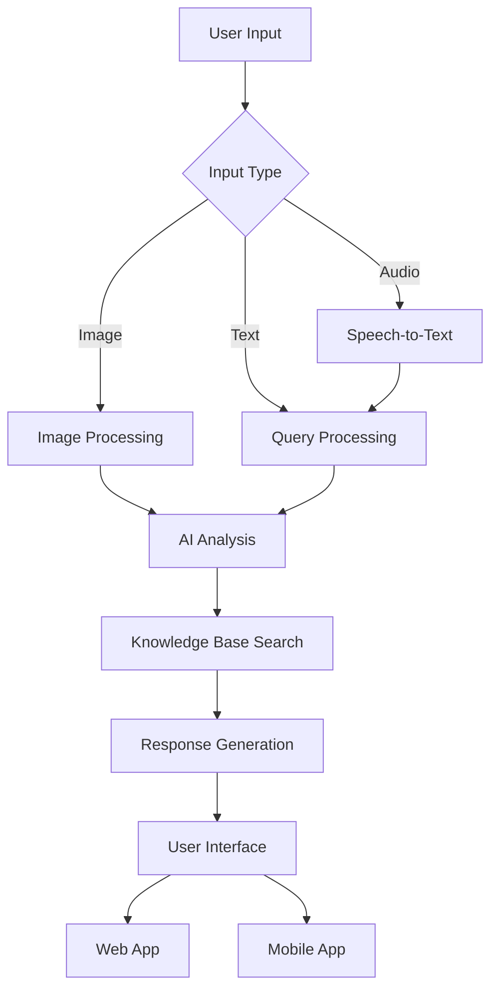

<div align="center">

# 🌱 KrishiSahayak+Gemma

[](https://opensource.org/licenses/MIT)
[](https://www.python.org/downloads/)
[](https://pytorch.org/)
[](https://gradio.app/)
[](https://developer.android.com/)

**Empowering Indian farmers with a reliable, 100% offline, AI-driven agricultural assistant.**

</div>

## 📋 Table of Contents
- [✨ Project Mission](#-project-mission)
- [🏗️ Architecture](#-architecture)
- [🚀 Getting Started](#-getting-started)
  - [Development Setup](#-development-setup)
  - [Mobile App](#-mobile-app)
- [📊 Project Structure](#-project-structure)
- [🤝 Contributing](#-contributing)
- [📄 License](#-license)

## ✨ Project Mission

KrishiSahayak+Gemma is an engineering initiative to solve a critical real-world problem: providing farmers in low-connectivity regions of India with access to advanced AI-driven agricultural advice.

The project's primary goal is to deliver a 100% offline, reliable, and user-friendly Android application that can run on low-resource smartphones (≤ 2GB RAM).

## 🏗️ Architecture

The project follows a strategic two-track approach to balance rapid prototyping with production readiness.

| Component | Purpose |
|-----------|----------|
| 🤖 AI Engine | The core language model for generating diagnostics. |
| 📚 Knowledge Base | A database for the Retrieval-Augmented Generation (RAG) system to ensure factual grounding. |
| 📱 Mobile App | The final, offline-first product for end-users. |

### 🔄 Data Flow



For detailed data strategy and regional coverage, see:
- [REGIONAL_COVERAGE.md](docs/REGIONAL_COVERAGE.md)
- [VERSIONING.md](docs/VERSIONING.md)

## 🚀 Getting Started

### Development Setup

To set up the development environment for the mobile application:

```bash
# Clone the repository
git clone https://github.com/VIKAS9793/KrishiSahayak_Gemma.git
cd KrishiSahayak_Gemma

# Install dependencies
pip install -r requirements.txt

# Set up the Android development environment
# (Refer to Android Studio setup guide for detailed instructions)
```

### Mobile App (Primary Solution)
The official end-user solution is our mobile application, specifically designed for production use with optimized performance for low-resource devices. The mobile app provides a complete, user-friendly experience for farmers in the field.

*Coming soon*

## 📱 Mobile Application

<div align="center">


</div>

**Status:** 🟡 Phase 2: MVP Development Starting

A fully offline-capable mobile application designed specifically for farmers in remote areas with limited or no internet connectivity.

**Technical Highlights:**
- Uses the validated, quantized `gemma-3n-q4_k_m.gguf` model.
- Optimized for low-end Android devices (≤ 2GB RAM).
- Deployed via offline P2P methods (SD card, local sharing), not the Play Store.

**Development Progress:**
- [x] Phase 1: Asset Production Complete (Model quantization, data pipeline, validation)
- [ ] Phase 2: Android App Development (Current Phase)
- [ ] Phase 3: Field Testing & Pilot Deployment
- [ ] Phase 4: Continuous Improvement & Scaling

## 📊 Project Structure

```
.
├── android_app/              # Native Android application (Phase 2)
├── web_demo/                 # Web-based development tools
├── docs/                     # Project documentation
│   ├── TECHNICAL_REPORT.md
│   ├── STRATEGY_AND_ROADMAP.md
│   ├── model_card.md
│   ├── REGIONAL_COVERAGE.md
│   └── VERSIONING.md
├── scripts/                  # Utility scripts
│   ├── validate_knowledge_base.py  # Validate knowledge base integrity
│   ├── eda_knowledge_base.py       # Exploratory data analysis
│   ├── enhance_knowledge_base.py   # Data enhancement utilities
│   └── evaluate.py                 # Model evaluation scripts
└── data/                     # Dataset and knowledge base files
    ├── raw/                 # Raw data files
    ├── processed/           # Processed data files
    └── _archive/            # Archived versions of knowledge base
```

### 📄 Key Files

| File | Purpose |
|------|---------|
| `data/processed/knowledge_base_v0_generic_46-class.csv` | Structured agricultural knowledge base |
| `web_demo/app.py` | Main Gradio web application |
| `web_demo/requirements.txt` | Python dependencies for development |
| `docs/model_card.md` | Model details and specifications |
| `docs/TECHNICAL_REPORT.md` | Comprehensive technical documentation |

## 🚀 Getting Started

### 📋 Prerequisites

| Requirement | Version | Installation |
|-------------|---------|--------------|
| Python | 3.8+ | [Download](https://www.python.org/downloads/) |
| pip | Latest | `python -m pip install --upgrade pip` |
| Git | Latest | [Download](https://git-scm.com/downloads) |
| Android Studio | 2022.3+ | [Download](https://developer.android.com/studio) |

### ⚙️ Installation

1. **Clone the repository**
   ```bash
   git clone https://github.com/VIKAS9793/KrishiSahayak_Gemma.git
   cd KrishiSahayak_Gemma
   ```

2. **Set up a virtual environment** (recommended)
   ```bash
   # Windows
   python -m venv venv
   .\venv\Scripts\activate
   
   # macOS/Linux
   python3 -m venv venv
   source venv/bin/activate
   ```

3. **Install dependencies**
   ```bash
   cd web_demo
   pip install -r requirements.txt
   ```

### 🌐 Development Setup

<div align="center">
  
  
</div>

1. **Start the application**
   ```bash
   python app.py
   ```

2. **Access the web interface**
   ```
   http://localhost:7860
   ```

   > 💡 **Tip**: The web interface will open automatically in your default browser.

### 📱 Building the Android App

<div align="center">
  
  
</div>

1. Open the `android_app` directory in Android Studio
2. Wait for project sync to complete
3. Connect an Android device or start an emulator
4. Click **Run** (▶️) to build and deploy

### 🔍 Verifying the Installation

1. **Check web dependencies**
   ```bash
   python -c "import torch; print(f'PyTorch version: {torch.__version__}')"
   python -c "import gradio; print(f'Gradio version: {gradio.__version__}')"
   ```

2. **Test the knowledge base**
   ```python
   import faiss
   import pandas as pd
   
   # Load sample data
   df = pd.read_csv('data/_archive/knowledge_base_v0_generic_46-class.csv')
   print(f"Knowledge base contains {len(df)} entries")
   ```

## 📚 Documentation

### 📄 Key Documents

| Document | Description |
|----------|-------------|
| [Technical Report](docs/TECHNICAL_REPORT.md) | Comprehensive technical specifications and data architecture |
| [Strategy & Roadmap](docs/STRATEGY_AND_ROADMAP.md) | Project strategy, phases, and future roadmap |
| [Model Card](docs/model_card.md) | Model details, performance, and limitations |
| [Technical Decision Log](docs/technical_decision_log.md) | Key technical decisions and rationale |
| [Versioning Strategy](docs/VERSIONING.md) | Version control and data management approach |

> 💡 All documentation is stored in the `docs/` directory. Please ensure documentation is kept up-to-date with code changes.

## 🤝 Contributing

<div align="center">
  
  
</div>

We welcome contributions from the community! Whether you're a developer, designer, or agricultural expert, there are many ways to contribute. Please read our [Contribution Guidelines](CONTRIBUTING.md) before getting started.

### 🛠 How to Contribute

1. **Fork** the repository
2. Create a **branch** for your feature (`git checkout -b feature/amazing-feature`)
3. **Commit** your changes (`git commit -m 'Add some amazing feature'`)
4. **Push** to the branch (`git push origin feature/amazing-feature`)
5. Open a **Pull Request**

### 🔍 Looking for First Issues?

Check out our [Good First Issues](https://github.com/VIKAS9793/KrishiSahayak_Gemma/issues?q=is%3Aissue+is%3Aopen+label%3A%22good+first+issue%22) to get started!

## 📄 License

<div align="center">
  <a href="LICENSE">
    
  </a>
  <a href="https://github.com/VIKAS9793/KrishiSahayak_Gemma/blob/main/LICENSE">
    
  </a>
</div>

This project is licensed under the **MIT License** - see the [LICENSE](LICENSE) file for details.

### 📝 License Summary

- **Permits**: Commercial use, modification, distribution, private use
- **Conditions**: Include original license and copyright notice
- **Limitations**: No liability, no warranty

## 📧 Contact & Support

<div align="center">
  <a href="mailto:vikassahani17@gmail.com">
    
  </a>
  <a href="https://github.com/VIKAS9793">
    
  </a>
</div>

**Project Maintainer**: Vikas Sahani  
**Email**: [vikassahani17@gmail.com](mailto:vikassahani17@gmail.com)  
**GitHub**: [@VIKAS9793](https://github.com/VIKAS9793)  

**Support Channels**:
- 🐛 [Report Issues](https://github.com/VIKAS9793/KrishiSahayak_Gemma/issues)
- 💬 [Join Discussions](https://github.com/VIKAS9793/KrishiSahayak_Gemma/discussions)
- 📚 [Documentation](docs/)

For any questions, feedback, or support, please don't hesitate to reach out through any of the channels above.

---

<div align="center">
  <p>Made with ❤️ for farmers and the open source community</p>
  
</div>