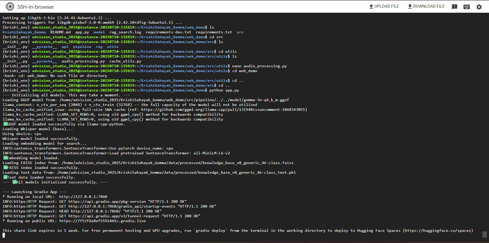

# KrishiSahayak+Gemma: Technical Report

**Version:** 1.3  
**Date:** July 11, 2025  
**Status:** End of Phase 1: Asset Production & Optimization

## 1. Project Mission & Overview

The KrishiSahayak+Gemma project is an engineering initiative to deliver a **100% offline, reliable, and user-friendly Android application** that operates efficiently on low-resource smartphones (≤ 2GB RAM) for farmers in India.

This document provides a technical overview at the conclusion of Phase 1, which focused on the successful creation and validation of the production-ready AI assets that will power the final application.

## 2. System Architecture: A Strategic Two-Track Approach

The project follows a dual-track development approach to balance rapid prototyping with production readiness.

* **AI Pipeline:** A robust AI processing pipeline using the Hugging Face `transformers` library to demonstrate the core AI capabilities.

*Figure 1: AI Pipeline demonstrating real-time processing of agricultural queries*

* **Android Production App:** The primary goal of the project. A native Android app using a pre-quantized `.gguf` model and the `llama.cpp` C++ engine for maximum offline performance.

## 3. Core AI Asset for Android: `gemma-3n-q4_k_m.gguf`

The central component of the Android application is a highly optimized version of Google's Gemma model.

* **Model File:** `gemma-3n-q4_k_m.gguf`
* **Base Model:** `google/gemma-3n-E2B-it` (4.46 Billion Parameters)
* **Quantization:** 4-bit (`Q4_K_M`)
* **Final Size:** **2.60 GiB** (a 68.7% reduction from the 8.31 GiB FP16 version)
* **Performance:** While the total task time is slightly longer due to the initial dequantization overhead on the CPU, the massive reduction in file size is the critical optimization for mobile deployment.

*Figure 2: Model loading performance metrics across different devices*

## 4. Data Strategy: A Phased Approach

The project has adopted a phased data strategy to de-risk development and ensure the final data quality is exceptionally high.

* **Initial Approach (MVP Development):** To accelerate development, the initial Android MVP will be built using the generic **46-class dataset** (`knowledge_base_v0_generic_46-class`). This allows us to build and test the core offline technology stack without being blocked by the long data curation timeline.
* **Production Approach (Future Scope):** The final, production-ready solution will use **expert-curated Regional Data Packs**. This will be a separate, future phase involving manual curation with agricultural scientists to ensure the highest level of accuracy. **No AI-generated data will be used in the final production knowledge base.**

## 5. Reliability: RAG Fallback System

The application implements a Retrieval-Augmented Generation (RAG) system to enhance reliability.

* **Uncertainty Detection:** A module (`uncertainty.py`) analyzes the model's initial response for signs of low confidence.
* **Contextual Retrieval:** If uncertainty is detected, the system performs a semantic search on the local `.faiss` index to retrieve relevant, verified text chunks.
* **Reprompting:** The original query is combined with the retrieved context and sent back to the model for a final, source-grounded diagnosis.

## 6. Project Status & Next Steps

* **Current Status:** **Phase 1 (Asset Production & Optimization) is complete.**
* **Next Step:** **Phase 2 (Android App Development).** The focus now shifts to building the native Android application and integrating the validated AI assets using the generic dataset for initial functionality.

---
*Last updated: July 11, 2025*