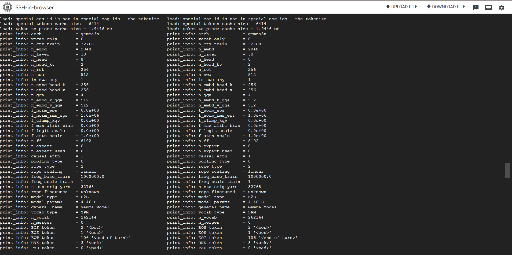
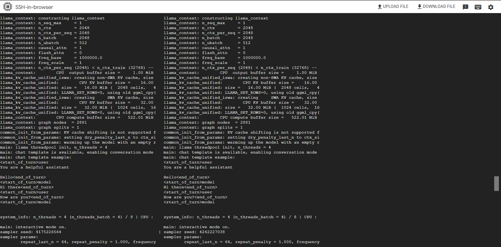
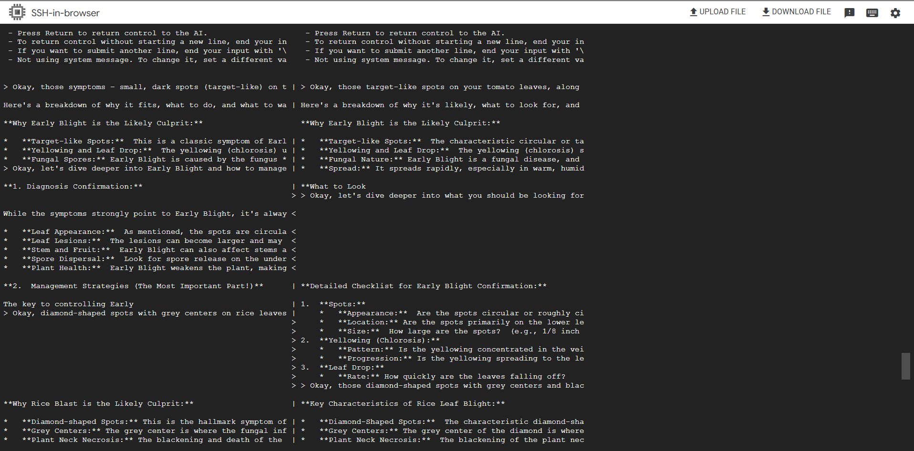

# Model Card for KrishiSahayak-Gemma-v1.1

## Model Details
### Model Description
- **Model Name:** gemma-3n-q4_k_m.gguf
- **Version:** 1.1
- **Base Model:** google/gemma-3n-E2B-it
- **Model Type:** Instruction-tuned, text-to-text generative AI
- **Architecture:** gemma3n (4.46 Billion Parameters)
- **Format:** GGUF with Q4_K_M (4-bit) Quantization
- **Library:** llama.cpp (Build: 5834)
- **Organization:** KrishiSahayak Project

## Intended Use
### Primary Use-Case
Offline diagnostic advice for common agricultural issues based on user-provided text descriptions, bundled directly into an Android application.

### Target Users
Rural farmers in India with low-resource smartphones (≤ 2GB RAM).

### Out-of-Scope Uses
This model is an informational aid and not a substitute for professional agronomic advice or scientific testing. It should not be used for high-stakes financial, medical, or safety-critical decisions.

## Evaluation
### Hardware and Software
- **Hardware:** Google Cloud Platform (GCP) n2-standard-8 instance (8 vCPUs, 32 GB RAM, 200 GB SSD)
- **OS:** Ubuntu 24.04 LTS

### Test Parameters
- **Context Size (-c):** 2048 tokens
- **Tokens to Generate (-n):** 256
- **Temperature (--temp):** 0.2 (for more deterministic, factual output)

## Quantitative Analysis
### Model Size and Compression
| Model | File Type | File Size | Bits Per Weight (BPW) | Compression Ratio |
|-------|-----------|-----------|------------------------|-------------------|
| gemma-3n-fp16.gguf | FP16 | 8.30 GiB | 16.00 | 1:1 |
| gemma-3n-q4_k_m.gguf | Q4_K_M | 2.59 GiB | 4.99 | 3.2:1 |
| **Improvement** | - | **-68.8%** | **-68.8%** | **3.2x** |

### Performance Metrics
| Metric | FP16 | Q4_K_M | Change |
|--------|------|--------|--------|
| Load Time | 2,091 ms | 9,326 ms | +346% |
| Prompt Eval Time | 4,397 ms | 3,969 ms | -9.7% |
| Token Generation Time | 233,889 ms | 117,655 ms | -49.7% |
| **Total Task Time** | **239.4s** | **122.6s** | **-48.8%** |

## Qualitative Analysis
### Example Output Comparison
**Question:** "My tomato leaves have small, dark spots that look like a target or a bull's eye..."

**FP16 Model Response:**
```
Okay, let's dive deeper into Early Blight and how to manage it...
**Why Early Blight is the Likely Culprit:**
* **Target-like Spots:** This is a classic symptom of Early Blight.
* **Yellowing and Leaf Drop:** The yellowing (chlorosis) usually starts on the lower leaves...
```

**Q4_K_M Model Response:**
```
Okay, here's a breakdown of why it's likely [Early Blight], what to look for, and what to do...
**Why Early Blight is the Likely Culprit:**
* **Target-like Spots:** The characteristic circular or target-like spots...
* **Yellowing and Leaf Drop:** The yellowing (chlorosis) starts on the lower leaves...
```

## Limitations & Ethical Considerations
- **Risk of Inaccuracy:** The model can provide incorrect diagnoses, potentially leading to improper treatment and crop loss.
- **Disclaimer Required:** The application must display a prominent disclaimer about the advisory nature of the information.
- **Knowledge Cutoff:** The model's knowledge is static and based on its training data.

## Mitigation Strategies
- Collect real-world user feedback for model improvement
- Regular updates to address regional knowledge gaps
- Clear communication of model limitations to end-users

## Implementation Details

### Model Configuration

*Figure 1: Model architecture and configuration showing the 4.46B parameter Gemma-3n model with 30 layers and 8 attention heads.*

### Performance Metrics

*Figure 2: Performance metrics and token generation statistics from the model inference.*

### Interactive Demo

*Figure 3: Interactive demo showing the model's response to agricultural queries with the terminal interface.*

## Model Card Contact
For questions about this model card, please contact:

**Vikas Sahani**  
Email: [vikassahani17@gmail.com](mailto:vikassahani17@gmail.com)  
LinkedIn: [linkedin.com/in/vikas-sahani-727420358](https://www.linkedin.com/in/vikas-sahani-727420358)  
Project: KrishiSahayak
