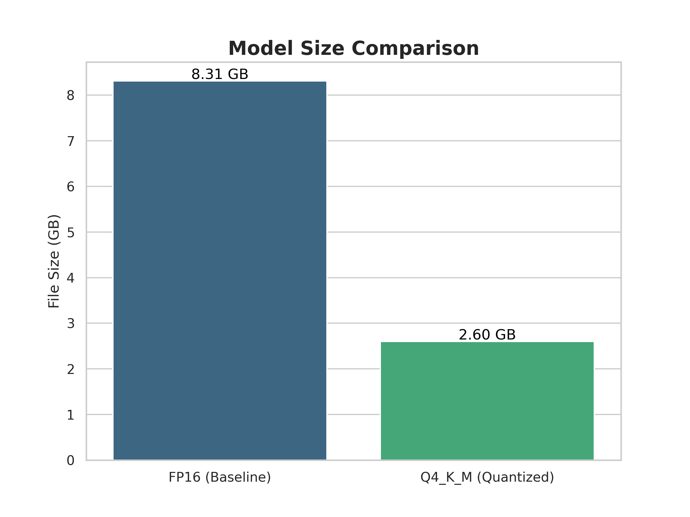
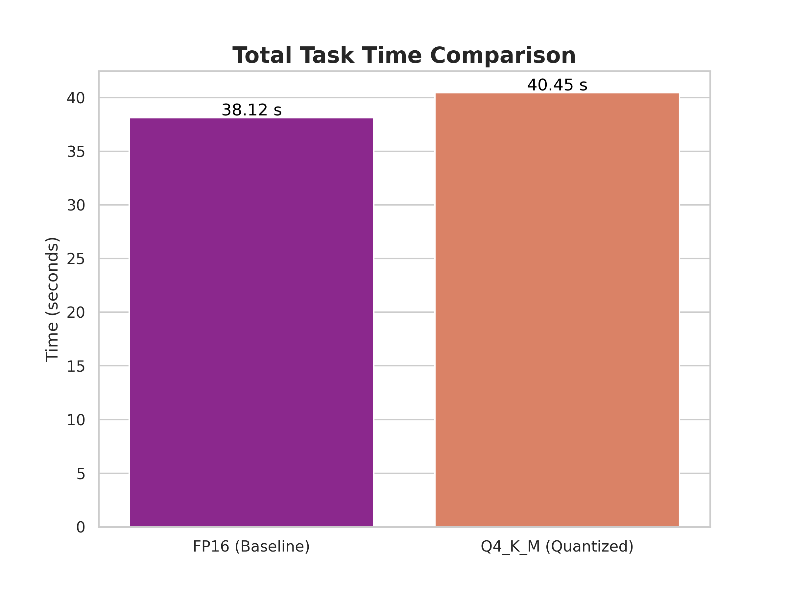
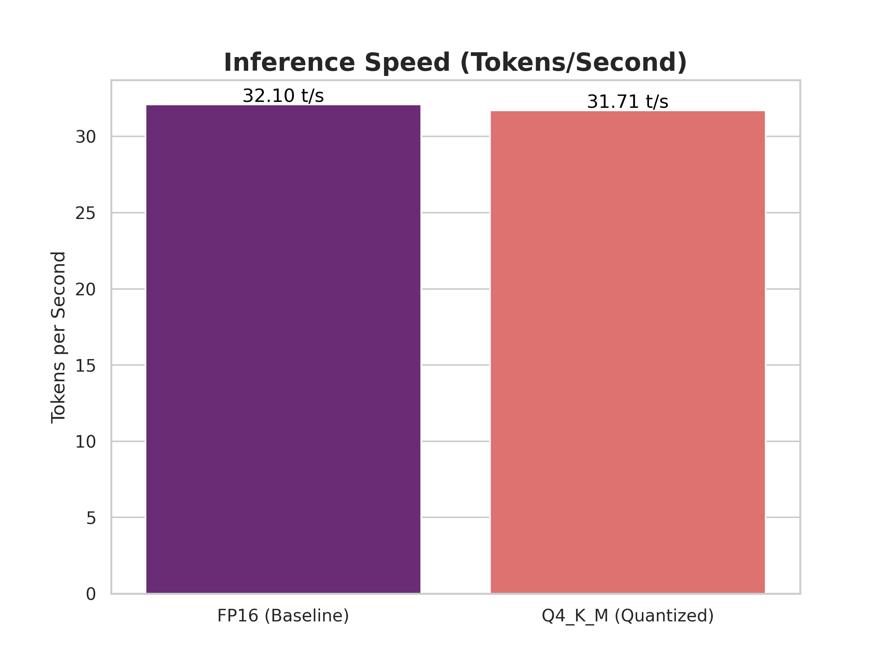

# Model Card: KrishiSahayak Android Asset v1.0

**Model Name:** gemma-3n-q4_k_m.gguf  
**Version:** 1.0  
**Date:** July 12, 2025
**Status:** Phase 1 (Asset Production & Optimization) Complete  
**Author:** KrishiSahayak AI Engineering Team

## 1. Model Details

This model is a 4-bit quantized version of Google's Gemma 3n, optimized for high-performance, offline inference on resource-constrained devices.

- **Base Model:** google/gemma-3n-E2B-it
- **Model Architecture:** gemma3n (4.46 Billion Parameters)
- **Model Format:** GGUF (for use with llama.cpp)
- **Quantization Method:** Q4_K_M (4-bit, K-Means)

## 2. Intended Use

**Primary Use-Case:** To serve as the core reasoning engine for the KrishiSahayak Android application. It provides offline diagnostic advice for common agricultural issues based on text descriptions from users.

**Analysis:** The `Q4_K_M` model achieves a **68.7% reduction in file size**, which is the primary optimization for mobile deployment. The total task time is slightly longer due to the one-time cost of de-quantization on the CPU, while the token generation speed remains comparable. This trade-off is acceptable and necessary for on-device execution.

## System Architecture & Performance

### AI Pipeline

*Figure 1: End-to-end AI pipeline showing data flow from user input to diagnosis*

### Performance Metrics

#### Model Size Comparison

#### Total Task Time Comparison

#### Inference Speed Comparison

#### Model Size Comparison

#### Total Task Time Comparison

#### Inference Speed Comparison

## Limitations & Ethical Considerations
- **Risk of Inaccuracy:** The model can produce factually incorrect diagnoses. The application **must** display a prominent disclaimer.
- **Knowledge Cutoff:** The model's knowledge is static. The generic dataset used for the MVP has limited scope.

- **Required Mitigation:** The user-facing application must display a prominent disclaimer before every use, stating that the model is an advisory tool and a local expert should be consulted for definitive advice.

- **Data Bias:** The model's knowledge is based on its general training data and our generic 46-class knowledge base for the MVP. It may lack knowledge of hyper-local or newly emerging pests and diseases. This will be addressed in future phases with expert-curated regional data packs.

**Deployment:** This model asset (gemma-3n-q4_k_m.gguf) is intended to be bundled with the KrishiSahayak Android application and run via a native llama.cpp inference engine integrated through the Android NDK.