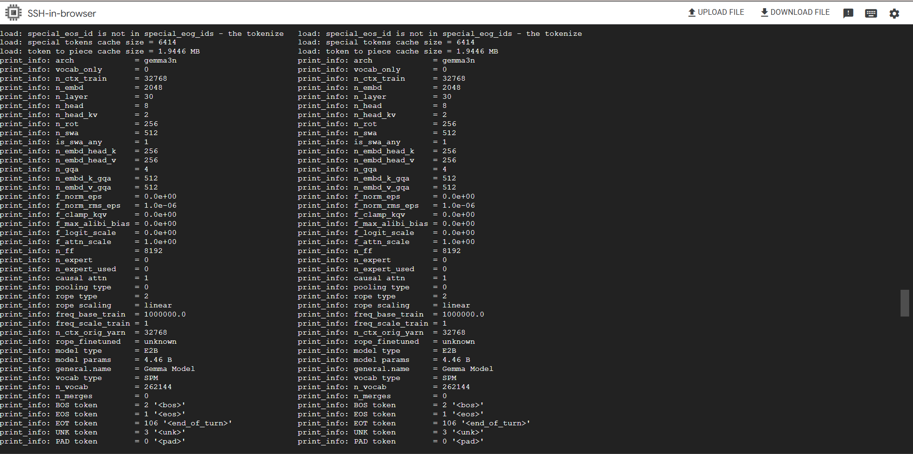

# Gemma Model Conversion and Quantization Guide

**Version:** 2.1  
**Date:** July 8, 2025

## Purpose
This guide documents the definitive process for converting and quantizing the Google Gemma 3n model into a deployment-ready asset for the KrishiSahayak application.

## 1. Background: The Strategic Pivot to a Dedicated Build Environment

A key technical challenge in this project was establishing a stable and reproducible environment for the model asset pipeline.

**Initial Approach & Limitations:**  
Initial attempts to perform the conversion in standard cloud notebook environments (e.g., Google Colab, Kaggle) were unsuccessful. These environments, while convenient, presented two major blockers:

1. **Resource Constraints:** The FP16 conversion process is memory-intensive and consistently caused crashes due to RAM limitations.
2. **Dependency Conflicts:** The pre-configured nature of notebook environments led to dependency conflicts with the specific versions required by the llama.cpp toolchain.

**Final Decision (The "Why"):**  
To overcome these issues and mitigate all technical risks, we made the strategic decision to use a dedicated, clean Google Cloud Platform (GCP) Virtual Machine. This approach provided full control over the environment, guaranteed access to the necessary CPU and RAM resources, and ultimately enabled the successful and reproducible creation of our model asset.

## 2. Environment Requirements

This process was successfully executed on a GCP instance with the following specifications:

- **OS:** Ubuntu 24.04 LTS (Noble Numbat)
- **CPU:** 8+ cores
- **RAM:** 32GB
- **Storage:** 200GB SSD

> 💡 **Note:** While GCP is used in this guide, any cloud provider or local machine that meets these specifications is suitable. Sufficient RAM (16GB+ minimum) is the most critical requirement.

## 3. Step-by-Step Conversion Process

The following commands represent the verified pipeline for creating the quantized model asset.

### Step 3.1: VM Setup and Dependencies

This prepares the virtual machine and installs all necessary tools and Python packages.

```bash
# Connect to GCP instance
gcloud compute ssh [YOUR_VM_NAME] --zone [YOUR_VM_ZONE]

# Install system dependencies
sudo apt update && sudo apt install -y build-essential git python3-pip cmake

# Install Python packages
pip3 install transformers torch numpy sentencepiece protobuf accelerate safetensors
```

### Step 3.2: Authentication

Log in to your Hugging Face account to gain access to the gated Gemma model repository.

```bash
# Login to Hugging Face
huggingface-cli login
```

### Step 3.3: Build llama.cpp

Clone the llama.cpp repository and compile the necessary C++ tools using cmake. The `-j$(nproc)` flag utilizes all available CPU cores to accelerate the build.

```bash
git clone https://github.com/ggerganov/llama.cpp.git
cd llama.cpp
mkdir build && cd build
cmake ..
cmake --build . --config Release -j$(nproc)
```

### Step 3.4: Model Download and Quantization

This two-stage process first downloads the model, then converts it to an intermediate FP16 format, and finally quantizes it to the production Q4_K_M format.

```bash
# Download the model
huggingface-cli download google/gemma-3n-E2B-it --local-dir gemma-model --exclude "*.gguf"

# Convert to GGUF format
python3 ../convert_hf_to_gguf.py gemma-model \
  --outfile gemma-model/gemma-3n-fp16.gguf \
  --outtype f16

# Quantize the model
./llama-quantize \
  gemma-model/gemma-3n-fp16.gguf \
  gemma-model/gemma-3n-q4_k_m.gguf \
  Q4_K_M
```

## 4. Visual Guide to Model Quantization

The following screenshots document the successful execution of the model quantization process:

### Step 1: Model Download and Conversion

*Figure 1: Downloading the Gemma 3n model and converting it to GGUF format*

### Step 2: Quantization Execution

*Figure 2: Running the quantization process with Q4_K_M settings*

### Step 3: Successful Completion

*Figure 3: Successful completion of model quantization*

## 5. Verification and Next Steps

After the pipeline completes, it is critical to verify the output and proceed with formal evaluation.

### Step 4.1: Verify Final Asset

Check the final file size to ensure the quantization was successful.

```bash
# Check final model size
ls -lh gemma-model/gemma-3n-q4_k_m.gguf
```

**Expected output:** The file size should be approximately 2.6 GB.

### Step 4.2: Performance Benchmarking

The final step before integration is to perform a rigorous benchmark of the Q4_K_M model against the FP16 baseline to quantify the trade-offs in performance and quality.

```bash
# Example test command
./llama-cli -m gemma-model/gemma-3n-q4_k_m.gguf -p "Hello, how are you?"
```

> **Note:** The complete results of our validation are documented in the project's official Model Card.

---
*Last updated: July 8, 2025*